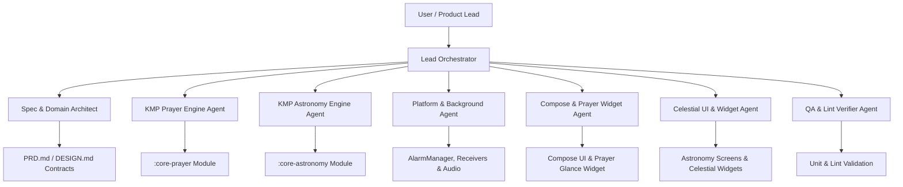

# Multi-Agent Operating Model (AGENTS.md) — AdzanNotif v2

## 1. Multi-Agent Collaboration Protocol (BMAD & Spec-Driven)
This document guides the orchestration of specialized subagents working concurrently on the AdzanNotif v2 codebase. All agents must operate under strict discipline:
- **Spec-Driven**: Every component must strictly adhere to `PRD.md` and `DESIGN.md`.
- **Anti-Slop & Controlled Output**: No excessive explanations, no dead code, no duplicate implementations.
- **SOLID & DRY**: Maximum reuse of calculations, utilities, and presentation tokens.
- **Pure Domain Decoupling**: Mathematical engines (`:core-prayer`, `:core-astronomy`) must remain 100% free of Android SDK dependencies (`android.*`).
- **No Dummy/Placeholder/Fabrication**: All computed values (prayer times, sun/moon positions, star coordinates, Hijri dates) must use real algorithms. No hardcoded fake data.

---

## 2. Specialized Subagent Roles



### Agent 1: Spec & Domain Architect
- **Mission**: Maintains domain models, interfaces, repository contracts, and use cases for both prayer and astronomy features.
- **Guardrails**: Ensures one-way dependency flow (Data & Presentation depend on Domain; Domain depends on nothing Android-specific). Owns `domain/model/`, `domain/repository/`, `domain/usecase/`.

### Agent 2: KMP Prayer Engine Agent
- **Mission**: Implements pure Kotlin astronomical prayer algorithms (`AstronomicalMath`, `SolarCoordinates`, `PrayerTimes`, `CalculationMethod`, `PrayerAdjustments`, `Qibla`) in `:core-prayer`.
- **Guardrails**: No Android platform imports in `:core-prayer`. Must maintain >95% unit test coverage for calculation parity against Kemenag & MWL tables.

### Agent 3: KMP Astronomy Engine Agent *(Sprint 2 — NEW)*
- **Mission**: Implements pure Kotlin celestial algorithms in `:core-astronomy`:
  - `SunMath` — Sun position, rise/set, solar noon, twilight times.
  - `MoonMath` — Moon position, rise/set/transit, phase, illumination, apogee/perigee.
  - `StarMath` — RA/Dec to azimuth/altitude conversion for observer position.
  - `HijriCalendar` — Umm al-Qura Islamic calendar algorithm.
  - `PhotoPhasePolicy` — Golden Hour / Blue Hour solar altitude threshold classification.
  - Data classes: `SunState`, `MoonState`, `MoonPhase`, `SolarPhase`, `TwilightTimes`, `GoldenBlueHour`, `HijriDate`, `StarPosition`.
  - Embedded assets: star catalog JSON (~500 stars), constellation lines JSON (40 constellations).
- **Guardrails**: Zero `android.*` imports. >90% unit test coverage. Accuracy: Sun rise/set ±2 min NOAA, Moon phase name exact, Hijri date matches Kemenag official.

### Agent 4: Platform & Background Agent
- **Mission**: Implements Android-specific background infrastructure for both prayer and celestial events:
  - `AdhanScheduler` (`AlarmManager.setExactAndAllowWhileIdle()`).
  - `BroadcastReceiver` (`AlarmReceiver`, `BootReceiver`, `TimeChangeReceiver`).
  - `CelestialAlarmReceiver` — handles Golden Hour, Moonrise, Full Moon alarms.
  - `WorkManager` (Midnight reconciliation, celestial event caching for next 7 days).
  - `NotificationHelper` (High importance adhan channel + Default importance celestial channel).
  - `AudioPlayer` (Media3 Adhan playback & DND mode).

### Agent 5: Compose & Prayer Widget Agent
- **Mission**: Builds responsive UI in Jetpack Compose Material 3 for prayer-focused screens:
  - Theme, typography, color tokens, and adaptive screen scaffolds (Compact, Medium, Expanded).
  - Home, Schedule, Settings, Qibla screens.
  - Prayer Glance Widget (Compact 2×2 + Detailed 4×2/4×3) + RemoteViews `Chronometer`.

### Agent 6: Celestial UI & Widget Agent *(Sprint 2 — NEW)*
- **Mission**: Builds responsive Compose UI for all astronomy/celestial screens and new Glance widgets:
  - `AstronomyDashboardScreen` + ViewModel.
  - `MoonDetailScreen` (Canvas-drawn Moon phase illustration) + ViewModel.
  - `SunDetailScreen` (Canvas-drawn Sun arc + twilight band timeline) + ViewModel.
  - `StarMapScreen` (Canvas 2D polar sky chart, 500 stars, 40 constellations, time slider) + ViewModel.
  - `HijriCalendarScreen` (dual Gregorian/Hijri grid, prayer dots, moon phase icons) + ViewModel.
  - `MoonWidget` (Glance — phase + illumination + moonrise countdown).
  - `SunWidget` (Glance — solar phase + next event + countdown).
  - Updates `Screen.kt`, `AdaptiveScaffold.kt` for new navigation destinations.
  - All design per `DESIGN.md §6` tokens.

### Agent 7: QA, Lint & Quality Verifier
- **Mission**: Validates clean code quality across all modules:
  - Runs ktlint / detekt / Android Lint on `:core-prayer`, `:core-astronomy`, `:app`.
  - Executes all unit test suites.
  - Verifies astronomy accuracy against reference values.
  - Confirms no regressions in prayer time calculation.
  - Verifies zero `android.*` imports in `:core-prayer` and `:core-astronomy`.

---

## 3. Communication & Delivery Rules
- Every module and class must have single responsibility (SRP).
- Repositories must act as single sources of truth.
- Presentation layers use unidirectional data flow: `StateFlow<UiState>` + `UiAction` events.
- `:core-prayer` and `:core-astronomy` have no dependencies on each other — they are independent pure-KMP modules both depended on by `:app`.
- No dummy data, no hardcoded placeholder values, no fabrication. All computed values derived from real algorithms.

---

## 4. Module Dependency Map (Sprint 2)

```
:core-prayer   (KMP — pure Kotlin, zero android.*)
    ↑ prayer time engine

:core-astronomy  (KMP — pure Kotlin, zero android.*)
    ↑ sun/moon/star/hijri engine

:app
    ├── depends on :core-prayer
    ├── depends on :core-astronomy
    └── Android layer: Hilt, Room, DataStore, Compose, Glance, AlarmManager, WorkManager, Media3
```

