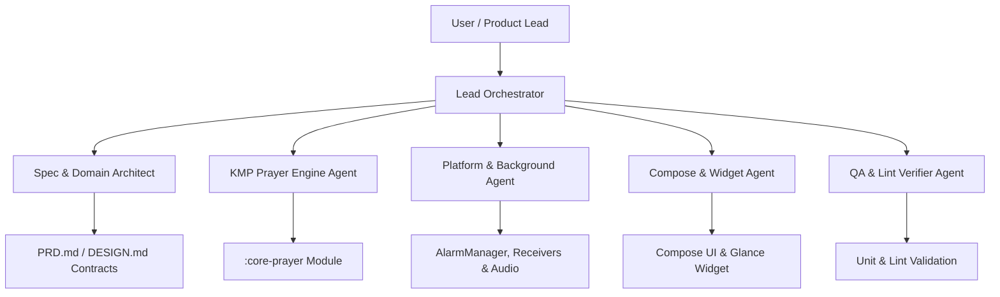

# Multi-Agent Operating Model (AGENTS.md) — AdzanNotif v2

## 1. Multi-Agent Collaboration Protocol (BMAD & Spec-Driven)
This document guides the orchestration of specialized subagents working concurrently on the AdzanNotif v2 codebase. All agents must operate under strict discipline:
- **Spec-Driven**: Every component must strictly adhere to `PRD.md` and `DESIGN.md`.
- **Anti-Slop & Controlled Output**: No excessive explanations, no dead code, no duplicate implementations.
- **SOLID & DRY**: Maximum reuse of calculations, utilities, and presentation tokens.
- **Pure Domain Decoupling**: Mathematical prayer engine must remain 100% free of Android SDK dependencies (`android.*`).

---

## 2. Specialized Subagent Roles

### Agent 1: Spec & Domain Architect
- **Mission**: Maintains domain models, interfaces, repository contracts, and use cases.
- **Guardrails**: Ensures one-way dependency flow (Data & Presentation depend on Domain; Domain depends on nothing).

### Agent 2: KMP Prayer Engine Agent
- **Mission**: Implements pure Kotlin astronomical algorithms (`AstronomicalMath`, `SolarCoordinates`, `PrayerTimes`, `CalculationMethod`, `PrayerAdjustments`, `Qibla`).
- **Guardrails**: No Android platform imports in `:core-prayer`. Must maintain >95% unit test coverage for calculation parity against Kemenag & MWL tables.

### Agent 3: Platform & Background Agent
- **Mission**: Implements Android-specific background infrastructure:
  - `AdhanScheduler` (`AlarmManager.setExactAndAllowWhileIdle()`).
  - `BroadcastReceiver` (`AlarmReceiver`, `BootReceiver`, `TimeChangeReceiver`).
  - `WorkManager` (Midnight reconciliation & recovery).
  - `NotificationHelper` (High importance & reminder channels).
  - `AudioPlayer` (Media3 Adhan playback & DND mode).

### Agent 4: Compose & Widget Agent
- **Mission**: Builds responsive UI in Jetpack Compose Material 3 and Home Screen Widgets in Jetpack Glance:
  - Theme, typography, color tokens, and adaptive screen scaffolds (Compact, Medium, Expanded).
  - Home, Schedule, Settings, and Qibla screens.
  - Glance Widget + RemoteViews `Chronometer` integration.

### Agent 5: QA, Lint & Quality Verifier
- **Mission**: Validates clean code quality, passes ktlint / detekt / Android Lint, runs all test suites, and eliminates regressions.

---

## 3. Communication & Delivery Rules
- Every module and class must have single responsibility (SRP).
- Repositories must act as single sources of truth.
- Presentation layers use unidirectional data flow: `StateFlow<UiState>` + `UiAction` events.
