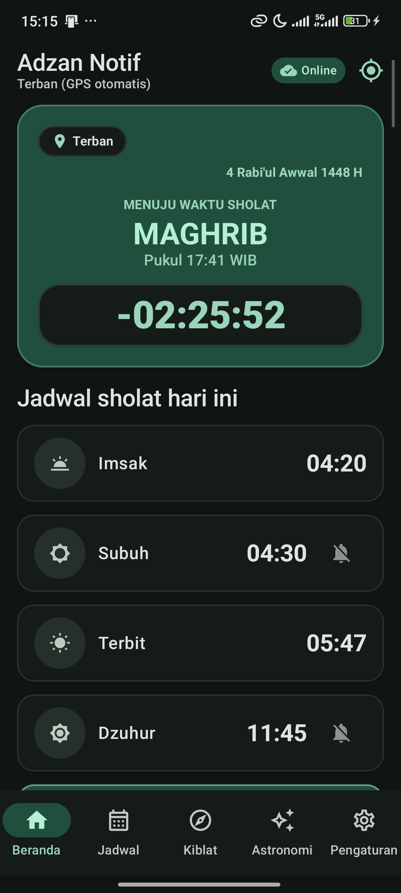
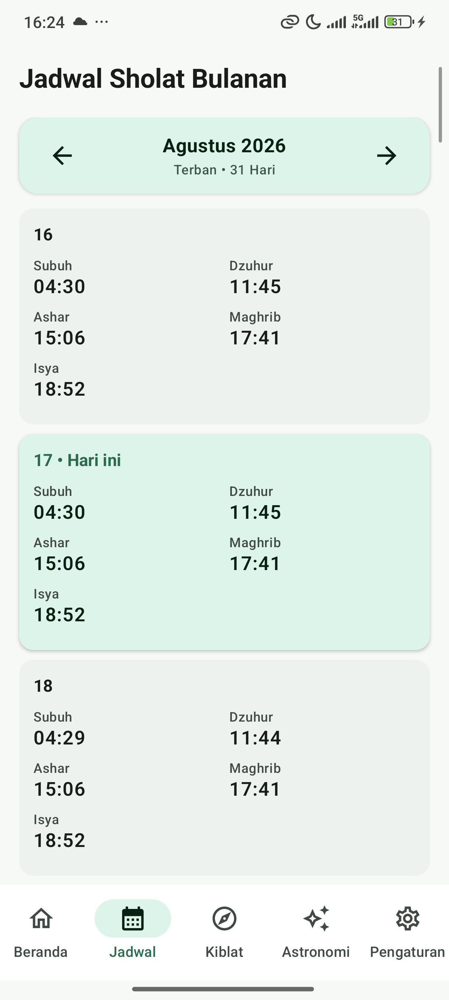
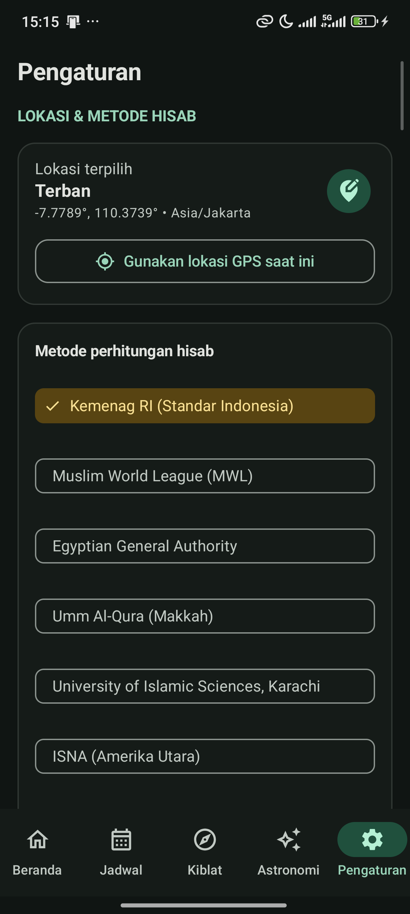
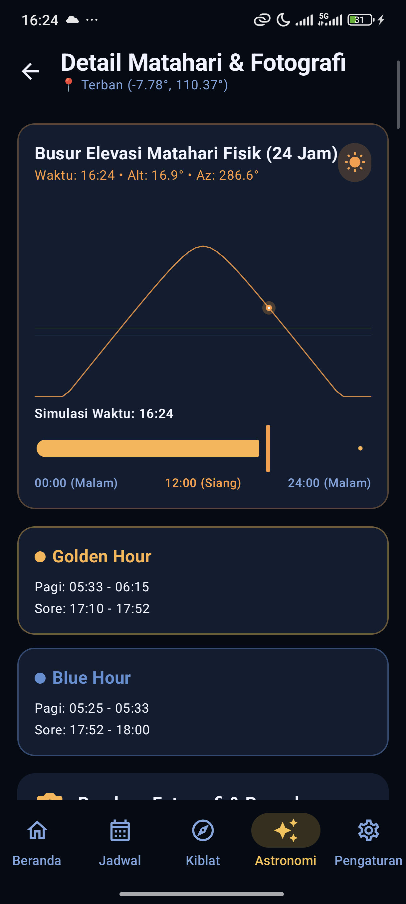
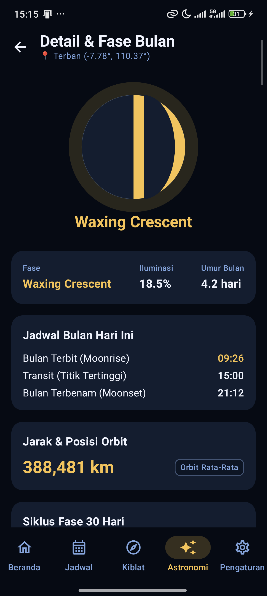
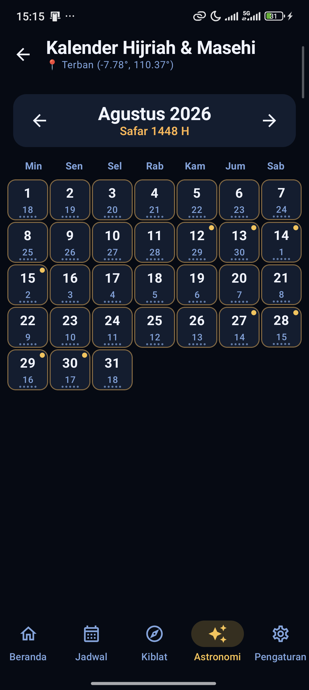
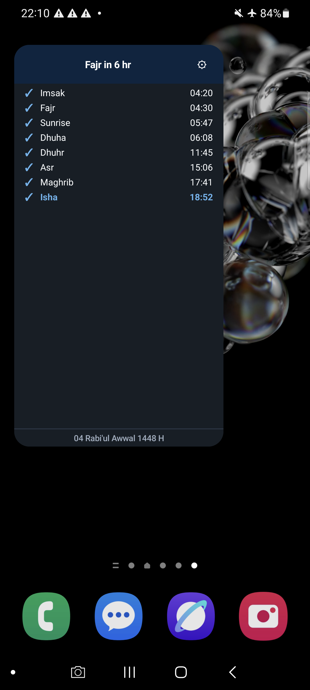
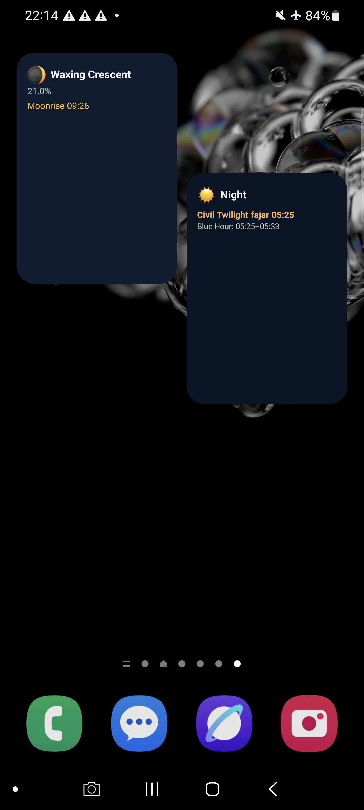

# 🕌 AdzanPlus — Modern, Offline-First Islamic Prayer Times & Astronomy Suite

[](https://kotlinlang.org/)
[](https://developer.android.com/jetpack/compose)
[](https://developer.android.com/topic/architecture)
[-3DDC84?style=for-the-badge&logo=android&logoColor=white)](https://developer.android.com/)
[](https://github.com/Adrian463588/AdzanPlus/releases/download/v1.0.0/app-release.apk)
[](#-devsecops--security-best-practices)
[](LICENSE)

---

## 📥 Unduh Aplikasi (Download APK v1.0.0)

- 🚀 **[Download AdzanPlus v1.0.0 APK](https://github.com/Adrian463588/AdzanPlus/releases/download/v1.0.0/app-release.apk)**
- 📦 **[Halaman Rilis GitHub & Catatan Pembaruan](https://github.com/Adrian463588/AdzanPlus/releases)**

Tautan asset tetap menggunakan path `v1.0.0/app-release.apk` sesuai kontrak distribusi. APK yang dibangun dari source saat ini memiliki metadata aplikasi `2.0.0 (versionCode 2)` dan ditandatangani dengan debug keystore karena repository tidak menyimpan production keystore; gunakan sebagai artifact validasi internal/device, bukan klaim signed production release.

---

## 📱 Live App Previews (Tampilan Fitur Lengkap)

Seluruh antarmuka aplikasi dibangun menggunakan **Jetpack Compose Material 3** dan **Jetpack Glance AppWidgets**, dengan kalkulasi waktu sholat dan observasi astronomi yang dihitung secara *real-time* langsung di perangkat (*100% Offline-First*).

### 🕋 1. Fitur Utama &amp; Ibadah

| Beranda &amp; Countdown | Jadwal Sholat Bulanan | Kompas Kiblat Presisi | Pengaturan &amp; Kalibrasi |
|:---:|:---:|:---:|:---:|
|  |  |  |  |

### 🌌 2. Suite Observasi Astronomi (`:core-astronomy`)

| Dashboard Astronomi | Detail Matahari &amp; Twilight | Detail Bulan &amp; Fase 30 Hari | Peta Bintang 2D Polar | Kalender Hijriah &amp; Masehi |
|:---:|:---:|:---:|:---:|:---:|
|  |  |  |  |  |

### 📱 3. Home Screen Widgets (Jetpack Glance)

| Widget Waktu Sholat &amp; Countdown 3×4 | Widget Observasi Astronomi (Sun &amp; Moon) |
|:---:|:---:|
|  |  |

---

## 📖 Overview

**AdzanPlus** adalah aplikasi jadwal sholat, pengingat adzan, dan suite observasi astronomi modern berbasis Android yang mengedepankan privasi pengguna, performa tinggi, efisiensi baterai, dan kemampuan **100% Offline-First**. 

Berbeda dengan aplikasi konvensional yang bergantung pada REST API pihak ketiga, AdzanPlus menghitung seluruh waktu sholat dan posisi benda langit langsung di perangkat menggunakan dua modul **Kotlin Multiplatform (KMP)** murni (`:core-prayer` dan `:core-astronomy`), sehingga tetap akurat tanpa memerlukan koneksi internet aktif.

---

## ✨ Fitur Unggulan

- 🕋 **Kalkulasi Astronomis On-Device (100% Offline)**:
  - Mendukung standar hisab **Kemenag RI (Kementerian Agama Republik Indonesia)** dengan koreksi ihtiyath (+2 menit).
  - Pilihan metode hisab internasional lengkap: **Muslim World League (MWL)**, **Umm Al-Qura (Makkah)**, **Egyptian General Authority of Survey**, **Karachi**, **ISNA**, **MUIS (Singapura)**, dan **Custom Method**.
  - Pilihan Madhab (Syafi'i/Hambali/Maliki vs Hanafi) dan aturan lintang tinggi (*High Latitude Rules*).
  - Koreksi menit per-waktu sholat (*Per-Prayer Minute Adjustments*) untuk kalibrasi masjid lokal.
  - Waktu sholat komprehensif: Subuh, Terbit (Syuruq), Dzuhur, Ashar, Maghrib, Isya, Imsak, Tengah Malam (*Midnight*), dan Sepertiga Malam Terakhir (*Tahajjud*).

- 🌌 **Suite Observasi Astronomi & Bintang (`:core-astronomy`)**:
  - **Dashboard Astronomi**: Indikator fase matahari real-time dengan animasi pulsa dinamis, kartu rangkuman matahari & bulan, dan timeline pita senja 24 jam.
  - **Detail Matahari & Fotografi**: Visualisasi Canvas busur elevasi matahari, perhitungan otomatis **Golden Hour** (-4° s/d +6°) dan **Blue Hour** (-6° s/d -4°) pagi & sore, serta jadwal senja sipil, nautikal, dan astronomis.
  - **Detail Bulan & Fase 30 Hari**: Ilustrasi Canvas fase bulan resolusi tinggi, waktu terbit/transit/terbenam, jarak orbit bumi (apogee/perigee), dan mini kalender fase interaktif 30 hari.
  - **Peta Bintang 2D Polar (Star Map)**: Proyeksi langit kutub berpusat Zenith dengan interaksi cubit-zoom (0.5x - 5.0x), pan geser, katalog 500 bintang Hipparcos (mag ≤ 4.5), 40 garis rasi bintang IAU, marker matahari/bulan, fitur ketuk-bintang untuk melihat info magnitudo/koordinat, dan slider simulasi waktu ±12 jam.
  - **Kalender Hijriah & Masehi**: Grid kalender dual Masehi-Hijriah berbasis hisab Umm al-Qura dengan 5 dot waktu sholat harian, highlight hari ini, penanda golden hour, dan bottom sheet rincian astronomis.

- ⏰ **Sistem Alarm & Notifikasi Presisi (Doze-Resistant)**:
  - **3 Mode Notifikasi Fleksibel per Waktu Sholat**: Pilihan kustomisasi lengkap antara **Suara Adzan Penuh** (audio autentik / file kustom), **Bip Notifikasi** (nada dering sistem ringkas), atau **Hanya Notifikasi / Tanpa Suara** (banner notifikasi senyap tanpa pemutaran suara).
  - Memanfaatkan `AlarmManager.setExactAndAllowWhileIdle()` untuk ketepatan waktu alarm bahkan saat perangkat dalam mode *Doze*.
  - Pemulihan otomatis setelah *reboot* (`BootReceiver`) dan deteksi pergantian zona waktu (`TimeChangeReceiver`).
  - Penjadwalan alarm benda langit (`CelestialAlarmReceiver`) untuk Golden Hour pagi dan Moonrise.
  - Rekonsiliasi harian mandiri via `WorkManager`.
  - Audio playback adzan autentik (Makkah, Madinah, Al-Aqsa, Mesir, Subuh) dengan fitur pratinjau suara langsung di Pengaturan.

- 📱 **Real-Time Home Screen Widgets (Responsive & Jetpack Glance)**:
  - **Prayer Timetable Widget (Muslim Pro Style)**: Menampilkan hitung mundur waktu sholat berikutnya secara *live* menggunakan `RemoteViews.Chronometer`, tanggal Hijriah aktual, serta timetable 8 waktu sholat (Imsak s/d Isya) dengan status centang (`✓`/`○`) dan highlight sholat aktif.
  - **Astronomy Suite Widget**: Widget observasi lengkap yang mengombinasikan fase surya, window **Golden Hour** & **Blue Hour** pagi & sore, fase bulan resolusi tinggi, persentase iluminasi, serta jadwal Moonrise/Moonset.
  - Pasang widget langsung 1-klik dari menu Pengaturan (*In-App Pin Widget*) atau menu launcher.

- 🧭 **Kompas Kiblat Presisi & Haptic Heartbeat**:
  - Perhitungan arah Ka'bah (21.4225° N, 39.8262° E) menggunakan algoritma *Great-Circle Bearing*.
  - Integrasi sensor geomagnetik dan akselerometer perangkat dengan low-pass filter untuk visualisasi kompas yang halus.
  - Getaran *hardware haptic feedback* otomatis dan heartbeat berkala saat perangkat mengarah tepat ke Ka'bah (±2°).
  - Informasi jarak langsung ke Ka'bah dalam kilometer.

- 🎨 **Modern Islamic Elegance (Material 3)**:
  - Palet warna eksklusif *Deep Emerald & Warm Gold* untuk sholat dan *Deep Night Sky & Celestial Amber* untuk astronomi.
  - Kontras tinggi dan keterbacaan sempurna di **Mode Terang (Light Mode)** maupun **Mode Gelap (Dark Mode)**.
  - Tata letak responsif (*Adaptive Layouts*) yang dioptimalkan untuk smartphone compact, perangkat lipat (*foldables*), dan tablet.

---

## 🛠️ Tech Stack & Arsitektur

AdzanPlus dibangun dengan prinsip **Clean Architecture**, **SOLID**, **DRY**, dan **Unidirectional Data Flow (UDF)**:

```
┌─────────────────────────────────────────────────────────────────────────┐
│                          :app (Android)                                 │
│  ┌────────────────────────────┐    ┌──────────────────────────────────┐ │
│  │     Jetpack Compose M3     │    │   Jetpack Glance AppWidgets      │ │
│  │  (Prayer & Astronomy UI)   │    │  (Prayer, Moon, and Sun Widgets) │ │
│  └─────────────┬──────────────┘    └────────────────┬─────────────────┘ │
│                │                                    │                   │
│                ▼                                    ▼                   │
│  ┌────────────────────────────────────────────────────────────────────┐ │
│  │                 ViewModels & UI State Holders                      │ │
│  └─────────────────────────────┬──────────────────────────────────────┘ │
│                                │                                        │
│                                ▼                                        │
│  ┌────────────────────────────────────────────────────────────────────┐ │
│  │  Data Layer (Room DB, DataStore, AlarmManager, WorkManager, Exo)   │ │
│  └─────────────┬────────────────────────────────────┬─────────────────┘ │
└────────────────┼────────────────────────────────────┼───────────────────┘
                 │                                    │
                 ▼                                    ▼
┌────────────────────────────────┐  ┌───────────────────────────────────┐
│   :core-prayer (KMP Shared)    │  │   :core-astronomy (KMP Shared)    │
│ ┌────────────────────────────┐ │  │ ┌───────────────────────────────┐ │
│ │ Pure Kotlin Prayer Times   │ │  │ │ Pure Kotlin Sun, Moon, Star   │ │
│ │ Astronomical Calculations  │ │  │ │ Map (500 Stars), & Hijri Math │ │
│ └────────────────────────────┘ │  │ └───────────────────────────────┘ │
└────────────────────────────────┘  └───────────────────────────────────┘
```

### Komponen Teknologi:
- **Language**: Kotlin 2.0+ & Kotlin Multiplatform (KMP)
- **UI Framework**: Jetpack Compose, Material 3, Compose Navigation
- **Widget**: Jetpack Compose Glance + RemoteViews Chronometer
- **Asynchronous**: Kotlin Coroutines & Reactive StateFlow / SharedFlow
- **Dependency Injection**: Dagger Hilt
- **Storage & Caching**: Jetpack Room Database & Jetpack DataStore Preferences
- **System Background Services**: Android `AlarmManager`, `BroadcastReceiver`, `WorkManager`
- **Audio & Media**: AndroidX Media3 ExoPlayer

---

## 📂 Struktur Direktori

```plaintext
AdzanPlus/
├── app/                                 # Modul Android Application
│   ├── src/main/
│   │   ├── java/com/adzannotif/
│   │   │   ├── data/                    # Repositories, Room DAOs, DataStore Preferences
│   │   │   ├── di/                      # Hilt DI Dependency Injection Modules
│   │   │   ├── domain/                  # UseCases & Business Contracts
│   │   │   ├── platform/                # AlarmManager, Receivers, Audio & Notifications
│   │   │   ├── presentation/            # Compose Screens (Home, Schedule, Astronomy, Qibla, Settings)
│   │   │   │   ├── astronomy/           # Astronomy Dashboard, Sun, Moon, Star Map, Hijri Calendar
│   │   │   │   ├── home/                # Home screen & countdown ticker
│   │   │   │   ├── qibla/               # Qibla compass, sensor fusion & haptics
│   │   │   │   ├── schedule/            # Monthly schedule & prayer time details
│   │   │   │   └── settings/            # Prayer adjustments & audio picker
│   │   │   ├── theme/                   # Material 3 Theme, Typography, Night Sky Colors
│   │   │   └── widget/                  # Jetpack Compose Glance & AppWidget Providers
│   │   ├── assets/                      # Bundled star catalog & constellation JSON
│   │   └── res/                         # Vector drawables, Authentic Audio assets, Layouts
│   └── build.gradle.kts
│
├── core-prayer/                         # Modul KMP Pure Prayer Calculation Engine (Zero android.*)
│   ├── src/
│   │   ├── commonMain/                  # Algoritma Astronomi, Solar Times, Qibla (Pure Kotlin)
│   │   └── commonTest/                  # Unit Tests (>95% coverage kalkulasi waktu sholat)
│   └── build.gradle.kts
│
├── core-astronomy/                      # Modul KMP Pure Celestial Engine (Zero android.*)
│   ├── src/
│   │   ├── commonMain/                  # SunMath, MoonMath, StarMath, HijriCalendar, GoldenHour
│   │   │   └── resources/               # star_catalog.json (500 stars), constellation_lines.json
│   │   └── commonTest/                  # Unit Tests (>90% coverage hisab astronomi & bintang)
│   └── build.gradle.kts
│
├── docs/                                # Dokumentasi teknis & screenshots aplikasi
│   └── screenshots/                     # Tangkapan layar beresolusi tinggi dari perangkat
├── .github/                             # GitHub Actions CI/CD workflows
├── .gitignore                           # DevSecOps Anti-Leakage rules
├── .gitattributes                       # Line normalization & binary assets handling
├── DESIGN.md                            # Design System & UI Specification
├── PRD.md                               # Product Requirements Document
├── AGENTS.md                            # Multi-Agent Operating Model
└── settings.gradle.kts
```

---

## 🚀 Memulai (Getting Started)

### Prasyarat
- **Android Studio**: Ladybug (2024.2.1) / Meerkat atau versi lebih baru.
- **JDK**: Java Development Kit 17 atau 21.
- **Android SDK**: Min SDK `API 24` (Android 7.0), Target SDK `API 35` (Android 15).

### Langkah Instalasi & Menjalankan

1. **Clone Repositori**:
   ```bash
   git clone https://github.com/Adrian463588/AdzanPlus.git
   cd AdzanPlus
   ```

2. **Buka di Android Studio**:
   - Buka Android Studio -> `Open Project` -> Pilih direktori `AdzanPlus`.
   - Biarkan Gradle melakukan sync dependensi secara otomatis.

3. **Build & Jalankan via Terminal / CLI**:
   ```bash
   # Menjalankan unit test modul sholat
   ./gradlew :core-prayer:test

   # Menjalankan unit test modul astronomi
   ./gradlew :core-astronomy:test

   # Menjalankan seluruh test suite aplikasi
   ./gradlew testDebugUnitTest

   # Build APK Debug
   ./gradlew assembleDebug

   # Install langsung ke perangkat/emulator yang terhubung
   adb install -r app/build/outputs/apk/debug/app-debug.apk
   ```

---

## 🔒 DevSecOps & Security Best Practices

Proyek ini menerapkan standar keamanan **DevSecOps** dan **Anti-Credential Leakage**:
1. **Zero Secret & Anti-Leakage Policy**: File konfigurasi lokal (`local.properties`, `key.properties`, `secrets.properties`), arsip keystore, dan modul referensi eksternal (`ReferenceProjects/`) dikecualikan dari version control publik melalui [`.gitignore`](.gitignore). `PRD.md`, `AGENTS.md`, `DESIGN.md`, dan dokumentasi `docs/` tetap dipelihara sebagai kontrak dan sumber referensi proyek.
2. **Keystore Protection**: Kunci tanda tangan aplikasi (`*.jks`, `*.keystore`, `*.p12`) tidak pernah disimpan di dalam repositori publik.
3. **Pure Domain Isolation**: Modul perhitungan waktu sholat (`:core-prayer`) dan astronomi (`:core-astronomy`) diisolasi penuh dari dependensi platform untuk menjamin keaslian dan portabilitas hisab.
4. **Privacy-First**: Aplikasi tidak memerlukan izin akses internet wajib untuk menghitung waktu sholat dan benda langit.

---

## 👨‍💻 Penulis & Signature

Dikonsep, dirancang, dan dikembangkan dengan dedikasi oleh:

**Adrian Syah Abidin**  
*Lead Software Engineer & Android Specialist*  
GitHub: [@Adrian463588](https://github.com/Adrian463588)

---

## 📄 Lisensi

Proyek ini dilisensikan di bawah [MIT License](LICENSE) — Bebas digunakan, dipelajari, dan dikembangkan untuk kebaikan umat.
